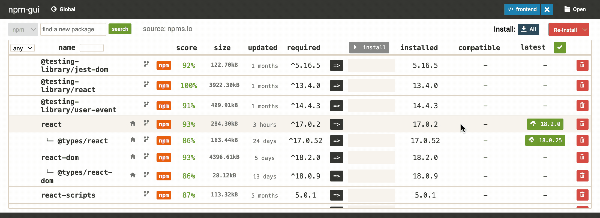
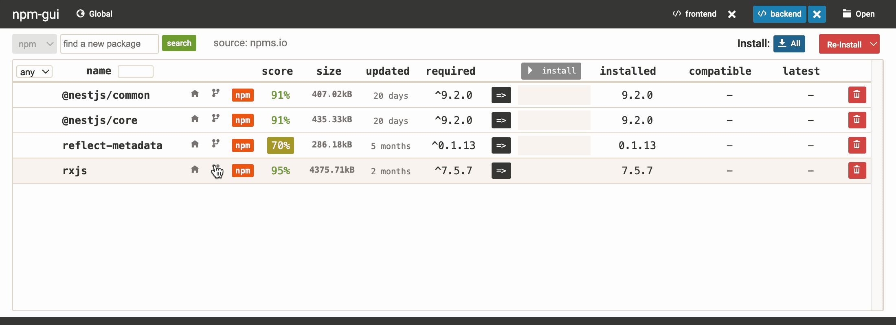
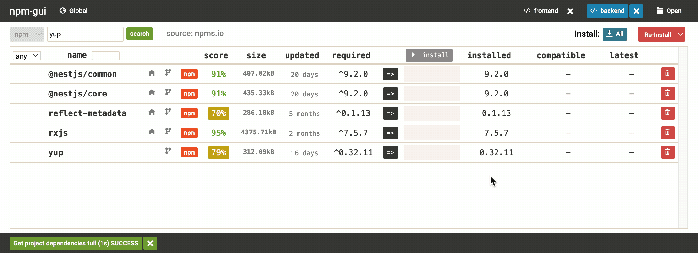
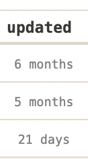

# [npm-gui](http://q-nick.github.io/npm-gui/)

[](https://github.com/q-nick/npm-gui/actions/workflows/build.yml)
[](https://github.com/q-nick/npm-gui/actions/workflows/linux.yml)
[](https://github.com/q-nick/npm-gui/actions/workflows/macos.yml)
[](https://github.com/q-nick/npm-gui/actions/workflows/windows.yml)

<a href="https://www.npmjs.com/package/npm-gui"></a>
<a href="https://www.npmjs.com/package/npm-gui"></a>
<a href="https://www.npmjs.com/package/npm-gui"></a>


## About

`npm-gui` is a convenient tool for managing javascript project dependencies listed in `package.json`. Under the hood, it will transparently use `npm`, `pnpm`, or `yarn` commands to install, remove or update dependencies
(_to use **yarn** it requires the **yarn.lock** file to be present in the project folder._)

- [x] global and project dependencies management
- [x] npm, yarn, and pnpm support
- [x] security scoring per package
- [x] package details (homepage, repository, version history)
- [x] upgrading package version
- [x] downgrading package version
- [x] search and install new dependencies

## Supported engines:

| npm | yarn | pnpm | pip | composer |
| --- | ---- | ---- | --- | -------- |
| ✔️  | ✔️   | ✔️   | ❌  | ❌       |

## Getting Started

The recommended way to run `npm-gui` is by using <a href="https://www.npmjs.com/package/npx">`npx`</a>:

```
~/$ npx npm-gui
```

It will run the most recent version of `npm-gui` without installing it on your system.

#### Installation as global dependency

`npm-gui` could also be installed as a global dependency:

```
~/$ npm install -g npm-gui
```

and then run with just:

```
~/$ npm-gui
```

#### Installation as local dependency (not-recommended)

```
~/$ npm install npm-gui
```

### How to use

`npm-gui` app will be accessible in the browser at the link http://localhost:13377/. Remember to first use the command below:

```
~/$ npx npm-gui
```

By default, the app will use the folder in which you started the command. Then you could navigate to the folder containing your project (containing `package.json`).


Or you could run the `npm-gui` command in your desired folder:

```
~/workspace/project1$ npx npm-gui
```

If you need to start the app on another `host/port` you could add a `host:port` argument to the command, for example:

```
~/$ npx npm-gui localhost:9000
```

## Navigating between projects

To change the project press the **folder icon** in the top-right corner. The navigation panel will allow you to change the folder - it must contain the **yarn.lock or package.json** file to be chosen.



## Installing new dependencies

To install a new dependency use input named _find a new package_ and the search button - results will appear on the list below. You must also decide whether will dependency be installed as production or development. After the successful installation of the new dependency, it will appear on the project list.



## Removing dependencies

To remove dependency from your project press the **trash icon** on the right and the green install button to confirm the action.



## Updating dependencies

To do a batch dependencies update and save new versions to package.json, for example, _compatible_, press one of the green buttons above the column of project dependencies.


## Other versions

To install an older version of the selected package, press the button with arrow `=>` and pick the desired version.


## Additional dependencies details

### Security scoring


### Size details


### Last update



## Authors and Contributors

@q-nick
